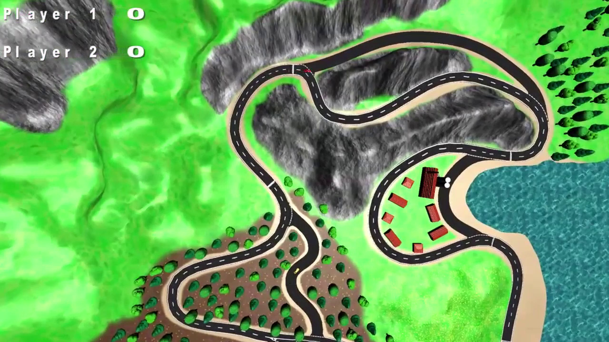

# Greedy Racer

The first major project as part of the game engineering bachelor´s degree at the university of applied sciences in Kempten was to design and create a racing game. As game engine one is required to use the Vektoria Engine. An educational game engine developed by Tobias Breiner.

Greedy Racer was our submission and is a very simple PvP racing game. The mechanics are very simple. The first of the two players to complete 3 lapses wins. The track has 3 shortcuts. A player can always decide to take a shortcut but on every cutoff there is a risk that he needs more time because something will block the road.

What exactly will block the road depends on the shortcut taken. On the first it is a tree trunk, on the second boulders and on the last beer barrels.

